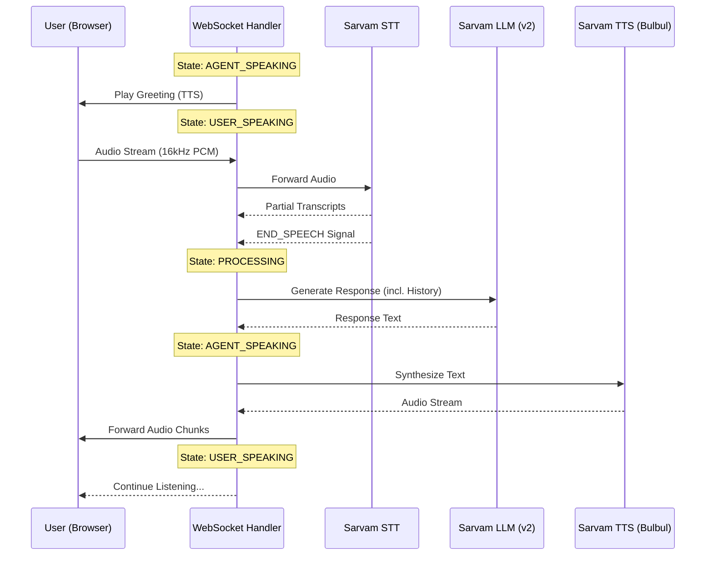

# Voice AI Project Flow Description

This document provides a comprehensive overview of how the Voice AI system operates, detailing the interaction between the frontend, backend, and various AI services.

## Architecture Overview

The system follows a turn-based conversation model managed by a state machine. It uses FastAPI for the backend WebSocket server and React for the frontend tester.

### Components

1.  **Frontend (React/Vite)**: Captures user audio, downsamples it to 16kHz, and streams it via WebSocket. It also receives and plays synthesized audio from the backend.
2.  **Backend (FastAPI)**: Manages the WebSocket connection, state machine, and service coordination.
3.  **STT Service (Sarvam AI)**: Transcribes the incoming audio stream into text.
4.  **LLM Service (Sarvam AI)**: Processes the transcript (with conversation history) and generates a contextual response.
5.  **TTS Service (Sarvam AI)**: Converts the LLM-generated text back into a streaming audio response.

## Conversation Flow

## Detailed State Machine

The backend `call_handler.py` manages the following states:

| State            | Description                                                                              | Transition Trigger                |
| :--------------- | :--------------------------------------------------------------------------------------- | :-------------------------------- |
| `AGENT_SPEAKING` | TTS is actively streaming audio to the user. STT ignores incoming audio to prevent echo. | TTS completion event received.    |
| `USER_SPEAKING`  | STT is actively listening and transcribing user audio.                                   | STT `END_SPEECH` signal received. |
| `PROCESSING`     | LLM is generating a response based on the transcript and history.                        | LLM response received.            |

## Implementation Details

- **Audio Coordination**: The system manually paces the audio chunks sent to the frontend to ensure smooth playback and avoid buffer overflow.
- **History Management**: The `LLMService` maintains a rolling window of the last 10 conversation turns to provide context for the response generation.
- **Silence Detection**: Handled by the Sarvam STT service's VAD (Voice Activity Detection), which signals when the user starts and stops speaking.
